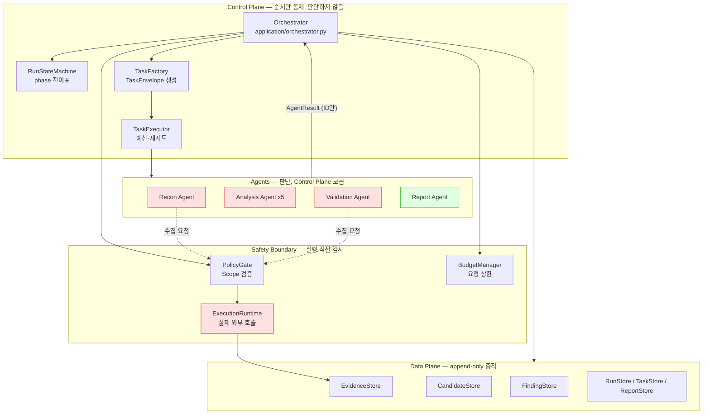
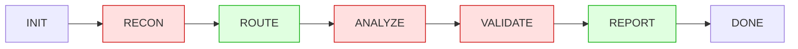
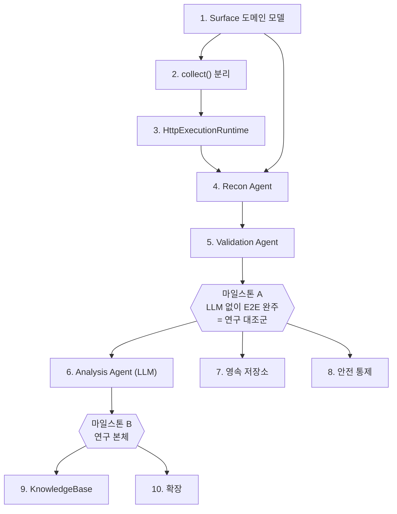

# 구현 계획 — Agentic AI 기반 모의해킹 프레임워크

이 문서는 `src/hacklipse` 스켈레톤에서 **무엇을 / 어떤 순서로 / 왜 만들어야 하는지**를 정리한다.
아키텍처 자체의 설계 근거는 Notion 연구과제 문서가 원본이고, 이 문서는 그 설계를 코드로 옮기는 작업 순서만 다룬다.

---

## 1. 현재 상태

스켈레톤은 **골격은 완성, 지능은 비어 있음** 상태다.
Control Plane(Orchestrator·State Machine·Task 실행·정책·예산)은 동작하고, Data Plane(Evidence·Candidate·Finding)의 불변식도 강제된다.
비어 있는 것은 **실제로 대상을 건드리는 부분**과 **판단을 내리는 부분**이다.

| 계층 | 상태 |
|---|---|
| `domain/` | ✅ 완성 — 단, `Surface` 모델 없음 |
| `ports/` | ✅ 완성 — 계약 12종 정의됨 |
| `application/` | ✅ 완성 — Orchestrator, StateMachine, TaskExecutor, TaskFactory, RuntimeEvidenceCollector |
| `adapters/` | ⚠️ 자리채움 — 저장소 전부 InMemory, Runtime은 전면 거부 |
| Agent 구현 | ❌ 8개 중 2개만 존재 (`report`, `evidence_collector`) |
| 안전 통제 | ❌ Scope/예산만 구현, 나머지 미구현 |

### 지금 존재하는 Agent

```
report              → adapters/reporting.py  MarkdownReportAgent      ✅
evidence_collector  → application/execution.py RuntimeEvidenceCollector ✅
recon               → 없음 (tests/test_end_to_end.py 의 대역만 존재)   ❌
xss_analyzer        → 없음                                            ❌
sqli_analyzer       → 없음                                            ❌
access_control_analyzer → 없음                                        ❌
path_traversal_analyzer → 없음                                        ❌
ssti_analyzer       → 없음                                            ❌
validation          → 없음                                            ❌
```

`bootstrap.build_local_application()`은 `report`와 `evidence_collector`만 자동 등록한다(`bootstrap.py:64-84`).
나머지는 호출자가 반드시 주입해야 하고, 지금은 테스트 fixture가 그 자리를 대신하고 있다.

---

## 2. 아키텍처 지도



빨간색이 이번에 만들어야 하는 것이다.

### 워크플로 상 어디가 비었는가



`ROUTE`(RuleBasedVulnerabilityRouter)와 `REPORT`(MarkdownReportAgent)만 돌아간다.
**RECON이 비어 있으므로 Evidence가 0개 → Router가 Candidate를 못 만듦 → 나머지가 전부 스킵된다.**
즉 이 파이프라인은 지금 실제 대상에 대해 아무 일도 하지 못한다.

---

## 3. 구현 순서

의존 관계상 아래 순서가 강제된다. 앞 단계를 건너뛰면 뒤에서 반드시 되돌아온다.



---

### Phase 1 — Surface 도메인 모델

**무엇** `domain/models.py`에 `Surface` dataclass 추가, `ports/repositories.py`에 `SurfaceStore` Protocol 추가, `adapters/memory.py`에 `InMemorySurfaceStore` 추가.

```python
@dataclass(frozen=True, slots=True)
class Surface:
    surface_id: str
    run_id: str
    url: str
    method: str
    parameters: tuple[str, ...] = ()
    requires_auth: bool = False
```

**왜 지금** 현재 `Run.surface_ids`, `Evidence.surface_id`, `Candidate.surface_id`, `TaskEnvelope.surface_id`가 전부 **그냥 `str`**이다. 공격 표면을 담을 구조체가 없어서, Recon이 발견한 URL·파라미터·메서드를 어디에도 저장할 수 없다. 이 상태로 Recon을 먼저 만들면 결과를 문자열 ID로만 흘리게 되고, Analysis Agent를 붙이는 시점에 전부 다시 손대야 한다.

**연결되는 기능** Notion §6 "Recon이 공격 표면을 구조화한다"(URL·HTTP 메서드·파라미터·입력 폼·인증 구간). Analysis Agent가 "이 파라미터를 테스트하라"는 판단을 내리려면 파라미터 목록이 구조화되어 있어야 한다.

**아키텍처상 위치** Data Plane. Evidence(관찰된 사실)와 Candidate(가설) 사이에 있는 **대상의 구조**를 표현한다.

**완료 기준** `Run.surface_ids`에 담긴 ID로 `SurfaceStore.get()`이 실제 구조체를 반환한다. `tests/test_invariants.py`에 Surface가 run 범위를 넘지 않는지 확인하는 케이스 1개.

---

### Phase 2 — `RuntimeEvidenceCollector.collect()` 분리

**무엇** `application/execution.py`의 `handle()` 내부를 두 개로 나눈다.

```python
def collect(self, run_id, target_url, spec, *, task_id) -> str:
    """정책→예산→Runtime→Evidence 저장 후 evidence_id 반환."""
    # 현재 handle()의 49-81행이 그대로 여기로 이동

def handle(self, task):
    # 43-47행 계약 검사만 남기고 collect() 호출
```

**왜 지금** 지금 구조상 **Recon Agent가 HTTP를 칠 방법이 없다.**
`TaskFactory.recon()`은 `allowed_tools=()`, `evidence_request=None`인 TaskEnvelope를 만드는데(`task_factory.py:18-26`), `RuntimeEvidenceCollector.handle()`은 그 둘이 반드시 있어야 동작한다(`execution.py:43-47`). 결과적으로 Recon은 정책 통제를 거친 실행 경로가 없다.

우회로는 두 가지인데 하나는 틀렸다:
- ❌ Recon에 `ExecutionRuntime`을 직접 주입 → 정책·예산 검사를 건너뛴다. **Notion §18 위반.**
- ✅ Recon에 `RuntimeEvidenceCollector`를 주입하고 `collect()`를 호출 → 검사 체인 재사용.

새 추상화를 만드는 게 아니라 기존 메서드에서 10줄을 빼내는 작업이다.

**연결되는 기능** Notion §18 "모든 외부 실행은 단일 통제 경계를 거친다". 이 경계가 뚫리면 Scope 위반과 예산 초과를 코드로 막을 수 없다.

**아키텍처상 위치** Safety Boundary. `ExecutionRuntime`을 호출하는 **유일한 지점**이라는 성질을 유지하면서 호출자를 하나 늘린다.

**완료 기준** 기존 `tests/test_end_to_end.py` 전부 통과(리팩터이므로 동작 변화 없음).

---

### Phase 3 — `HttpExecutionRuntime`

**무엇** `adapters/http_runtime.py` 신규. `urllib.request` 기반, 표준 라이브러리만 사용.

핵심 요구사항 하나: **리다이렉트를 따라가면 안 된다.**

```python
class _NoRedirect(urllib.request.HTTPRedirectHandler):
    def redirect_request(self, *args, **kwargs):
        return None
```

**왜 이 처리가 필요한가** PolicyGate는 **원래 URL만** 검증한다(`adapters/policy.py`). `urlopen`은 기본적으로 302를 따라가므로, 대상이 외부 도메인으로 리다이렉트하면 allowlist 밖으로 요청이 나간다. 리다이렉트를 `HTTPError`로 만들어 Evidence에 기록하면, 우회도 막고 리다이렉트 사실 자체도 증적으로 남는다.

**연결되는 기능** Notion §15 안전 통제. `DisabledExecutionRuntime`을 이걸로 교체하는 순간 시스템이 **처음으로 실제 네트워크를 친다.**

**아키텍처상 위치** Safety Boundary의 바깥 끝. 이 클래스 뒤가 통제 불가능한 외부 세계다.

**⚠️ 착수 전 확인** 첫 대상은 **로컬 컨테이너(DVWA / juice-shop)로 한정**하고 `RunScope.allowed_hosts`를 `localhost`로 고정한다. 실서비스를 겨냥하려면 그 대상에 대한 별도 인가 확인이 먼저다.

**완료 기준** 로컬 컨테이너 대상으로 `collect()` 1회 호출 → EvidenceStore에 응답이 저장된다. allowlist 밖으로 리다이렉트하는 엔드포인트가 `ExternalExecutionDisabled` 대신 리다이렉트 Evidence를 남기는지 확인.

---

### Phase 4 — Recon Agent (LLM 없음)

**무엇** `adapters/recon.py` 신규. `RuntimeEvidenceCollector`를 주입받아 대상 URL을 요청하고, 응답에서 폼·링크·쿼리 파라미터를 뽑아 `Surface`로 저장한 뒤 `AgentResult(surface_ids=..., new_evidence_ids=...)`를 반환한다.

HTML 파싱은 `html.parser.HTMLParser`(표준 라이브러리)로 충분하다.

**왜 지금** 파이프라인의 **첫 단추**다. Recon이 Evidence를 만들지 않으면 Router가 Candidate를 못 만들고(`orchestrator.py:119`), 워크플로가 ROUTE에서 바로 REPORT로 점프한다. 지금 이 시스템이 아무것도 못 하는 유일한 이유.

**왜 LLM을 안 쓰는가** 크롤링과 폼 추출은 결정적 작업이다. LLM을 넣으면 비용과 비결정성만 늘고 정확도는 나아지지 않는다. 그리고 이 결정적 버전이 **연구의 대조군**이 된다(Notion §17: 휴리스틱·단일 LLM·멀티에이전트 비교 실험).

**연결되는 기능** Notion §6 Recon 단계. 산출물인 `Surface`와 `Evidence`가 §8 Router의 입력이 된다.

**아키텍처상 위치** Agent 계층의 진입점. Control Plane을 전혀 모르고, `TaskEnvelope`를 받아 `AgentResult`를 돌려주기만 한다.

**완료 기준** 로컬 대상에 대해 `orchestrator.start()`가 RECON→ROUTE를 통과하고 `run.candidate_ids`가 비어 있지 않다.

---

### Phase 5 — Validation Agent (LLM 없음)

**무엇** `adapters/validation.py` 신규. Candidate와 Evidence ID를 받아 **재현 요청을 직접 수행**하고 판정을 내린다.

- 재현 성공 → `CONFIRMED`
- 증적 부족 → `evidence_requests`를 채워 반환 (Orchestrator가 수집 Task를 만든다)
- 재현 실패 → `REJECTED`

**왜 이 순서인가** Validation이 있어야 `Finding`이 생성되고, 그래야 REPORT 단계가 실제 내용을 갖는다. 그리고 `Finding.from_confirmed()`의 4개 불변식(`models.py:269-276`)이 실제 데이터로 검증된다.

**중요한 제약** Validation Task에는 **Analysis의 추론이 전달되지 않는다**(`task_factory.py:42-59`가 surface_id/candidate_id/evidence_ids만 전달). 이건 버그가 아니라 설계다 — Notion §10 "Validation은 Analysis 결론에 오염되지 않고 독립 판정한다". Validator는 증적만 보고 스스로 결론을 낸다.

**연결되는 기능** Notion §10(독립 검증), §11(증적 부족 루프). §11 루프는 `orchestrator.py:200-231`에 이미 구현되어 있고, **이 Agent가 그 루프를 처음으로 실제 작동시킨다.**

**아키텍처상 위치** Agent 계층. Data Plane에 대한 read 권한과 수집 요청 권한만 갖고, Finding 생성 권한은 없다(Orchestrator가 한다).

**완료 기준 — 🎯 마일스톤 A**
로컬 대상에 대해 `INIT → RECON → ROUTE → ANALYZE → VALIDATE → REPORT → DONE` **전 구간이 LLM 없이 완주**하고 Markdown 보고서가 나온다.
이 시점의 결과가 **연구 비교 실험의 baseline**이다.

> Phase 5까지는 Analysis Agent 자리에 "Router가 만든 Candidate를 그대로 통과시키는" 최소 구현을 넣어도 된다. Analysis의 지능은 Phase 6에서 붙인다.

---

### Phase 6 — Analysis Agent (LLM)

**무엇** `adapters/analysis/` 아래 5종: `xss`, `sqli`, `access_control`, `path_traversal`, `ssti`.
`Router`가 배정하는 이름과 정확히 맞춰야 한다(`adapters/routing.py` `DEFAULT_RULES`).

각 Agent는 Evidence를 읽고 → LLM으로 취약 가설을 세우고 → 검증용 요청을 `collect()`로 수행하고 → 결과 Evidence ID를 반환한다.

**왜 마지막인가** **연구의 본체이자 가장 비싼 부분이다.** Phase 1~5가 없으면 LLM에게 줄 입력(구조화된 Surface, 실제 응답 Evidence)이 없어서 프롬프트를 설계할 수 없다. 그리고 대조군이 먼저 있어야 "LLM이 실제로 나은가"를 측정할 수 있다.

**연결되는 기능** Notion §9 Analysis 단계, §17 비교 실험. LLM 호출 비용이 §3 예산 관리의 실제 대상이 된다(현재 `InMemoryBudgetManager`는 요청 횟수만 세므로 Phase 10에서 교체 필요).

**아키텍처상 위치** Agent 계층. 5개 Agent는 서로를 전혀 모르고, 공유 상태도 없다. 통신은 Orchestrator를 통한 Task/Result뿐이다(Notion §18).

**완료 기준 — 🎯 마일스톤 B** 결정적 baseline과 LLM 버전의 탐지율·오탐률을 같은 대상에서 비교할 수 있다.

---

### Phase 7 — 영속 저장소

**무엇** `adapters/sqlite_store.py`. `MemoryStoreBundle`과 동일한 6개 Protocol을 SQLite로 구현.

**왜** 현재 6개 저장소 전부 `InMemory*`라서 **프로세스가 끝나면 Run이 사라진다.** `Orchestrator.resume(run_id)`는 이미 구현되어 있지만(`orchestrator.py:104`), 저장소가 휘발성이라 같은 프로세스 안에서만 의미가 있다.

**연결되는 기능** Notion §4 "실행 상태 저장과 재개". 장시간 Run, 중단 후 재개, 실험 결과 보존이 전부 여기 달려 있다.

**아키텍처상 위치** Data Plane 어댑터 교체. `EvidenceStore` Protocol에 `update`가 없다는 점(append-only)을 스키마에서도 유지한다 — Evidence 테이블에 UPDATE를 하지 않는다.

**완료 기준** 프로세스를 죽였다 살린 뒤 `resume(run_id)`가 중단 지점부터 이어서 실행된다.

---

### Phase 8 — 안전 통제

Notion §15에 명시되어 있으나 **코드에 흔적조차 없는** 항목들. 실제 대상을 상대하기 시작한 뒤에는 필수다.

| 항목 | 현재 | 해야 할 일 |
|---|---|---|
| 실행시간 제한 | `TaskEnvelope.timeout_seconds` **소비처 0곳** | `TaskExecutor` 또는 Runtime에서 실제 적용 |
| 인증정보 참조 | `TaskEnvelope.credential_ref` **소비처 0곳** | 참조를 실제 자격증명으로 바꾸는 resolver, 원문은 Task에 절대 안 실림 |
| 민감정보 마스킹 | 없음 | Evidence 저장 직전 훅 — 토큰·쿠키·PII 마스킹 |
| 전체 실행 감사 로그 | 없음 | `ExecutionRequest` 단위로 시각·대상·도구 기록 |
| 위험 요청 사람 승인 | 없음 | `PolicyGate`에 승인 대기 판정 추가 |
| Agent별 도구 allowlist | `allowed_tools`가 `execution.py:46` 한 곳에서만 검사 | Agent 등록 시점에 도구 집합 고정 |

**왜 이 시점인가** Phase 3에서 실제 네트워크가 열렸고, Phase 6에서 LLM이 요청을 생성하기 시작한다. **LLM이 만든 요청이 통제 없이 나가는 구간이 생기면 안 된다.** 마스킹과 감사 로그는 특히 Phase 6 전에 있는 게 안전하다.

**아키텍처상 위치** Safety Boundary 강화. 지금 이 경계는 Scope와 요청 수만 막고 있다.

---

### Phase 9 — KnowledgeBase

**무엇** `ports/knowledge.py`의 `KnowledgeBase` Protocol 구현.

**왜 마지막인가** 이 Port는 정의만 되어 있고 **`ports/` 밖 어디에서도 참조되지 않는다.** Orchestrator에 주입 지점조차 없어서 배선부터 새로 해야 한다. 그리고 축적할 지식(과거 Run의 Finding)이 있어야 의미가 있으므로 Phase 6 이후가 자연스럽다.

**연결되는 기능** 과거 사례 재사용, RAG. `KnowledgeCase.provenance_refs`가 출처 추적용으로 이미 준비되어 있다.

**아키텍처상 위치** **Evidence Store와 의도적으로 분리된 별도 Plane.**
Evidence는 "이번 대상에서 직접 관찰한 사실", Knowledge는 "민감정보를 제거하고 일반화한 재사용 지식"이다. 이 둘을 섞으면 다른 대상의 데이터가 현재 Run의 증적으로 오염된다.

---

### Phase 10 — 확장

우선순위 낮음. 필요해지면 교체한다.

| 항목 | 현재 | 교체 방향 |
|---|---|---|
| `InMemoryBudgetManager` | 요청 횟수만 카운트 | LLM 토큰·비용·시간 기반 (Notion §3) |
| `RuleBasedVulnerabilityRouter` | 고정 규칙 5개 | 모호한 사례만 LLM 라우팅 (Notion §8) |
| `BoundedRetryPolicy(max_attempts=1)` | 사실상 재시도 없음 | 백오프 + 실패 유형별 정책 |
| `MarkdownReportAgent` | Markdown만 | JSON / HTML / PDF / Dashboard (Notion §13) |
| `Finding.severity` | 항상 `"unrated"` | CVSS 등 산정 로직 |
| `RouteDecision.priority` | 정렬에만 사용 | 예산 배분에 반영 |
| `AllowlistPolicyGate` | `safe` 프로필 하나 | 프로필별 정책 분리 |
| `HttpExecutionRuntime` | HTTP만 | 브라우저 Runtime (JS 렌더링 필요 시) |

---

## 4. 파일 매니페스트

🆕 신규 생성 · ✏️ 기존 수정

### Phase 1 — Surface 도메인 모델 (신규 파일 없음)

| | 파일 | 작업 |
|---|---|---|
| ✏️ | `src/hacklipse/domain/models.py` | `Surface` dataclass 추가 |
| ✏️ | `src/hacklipse/domain/__init__.py` | `Surface` export |
| ✏️ | `src/hacklipse/ports/repositories.py` | `SurfaceStore` Protocol 추가 |
| ✏️ | `src/hacklipse/ports/__init__.py` | `SurfaceStore` export |
| ✏️ | `src/hacklipse/adapters/memory.py` | `InMemorySurfaceStore` + `MemoryStoreBundle.surfaces` |
| ✏️ | `tests/test_invariants.py` | Surface가 run 범위를 넘지 않는지 1케이스 |

### Phase 2 — collect() 분리 (파일 1개)

| | 파일 | 작업 |
|---|---|---|
| ✏️ | `src/hacklipse/application/execution.py` | `handle()` 49–81행 → `collect()`로 이동 |

테스트는 손대지 않는다. 기존 `tests/test_end_to_end.py`가 그대로 통과해야 리팩터가 맞은 것이다.

### Phase 3 — HttpExecutionRuntime

| | 파일 | 작업 |
|---|---|---|
| 🆕 | `src/hacklipse/adapters/http_runtime.py` | `HttpExecutionRuntime`, `_NoRedirect` |
| ✏️ | `src/hacklipse/adapters/__init__.py` | export 추가 |
| 🆕 | `tests/test_http_runtime.py` | 리다이렉트가 allowlist를 넘지 않는지 |

`adapters/runtime.py`의 `DisabledExecutionRuntime`은 **지우지 않는다.** 기본값으로 계속 쓰인다.

### Phase 4 — Recon Agent

| | 파일 | 작업 |
|---|---|---|
| 🆕 | `src/hacklipse/adapters/recon.py` | `ReconAgent` — `html.parser`로 폼·링크·파라미터 추출 |
| ✏️ | `src/hacklipse/adapters/__init__.py` | export 추가 |
| ✏️ | `src/hacklipse/application/task_factory.py` | `recon()`에 `allowed_tools` 부여 (현재 `()`) |
| ✏️ | `src/hacklipse/bootstrap.py` | `LocalApplication`에 `collector` 필드 노출 |
| 🆕 | `tests/test_recon.py` | Surface 추출 결과 |

> **`bootstrap.py`를 왜 건드려야 하나** — `RuntimeEvidenceCollector`는 `build_local_application()` **안에서** 생성되는데(`bootstrap.py:77`), `ReconAgent`는 그 collector를 주입받아야 하면서 동시에 `agents` 인자로 **들어가야** 한다. 순환이다.
> 가장 짧은 해법: `LocalApplication`에 `collector` 필드를 추가하고, 빌드 후 `app.dispatcher.register("recon", ReconAgent(collector=app.collector, ...))`로 등록한다. 필드 1개 + 반환값 1줄.

### Phase 5 — Validation Agent

| | 파일 | 작업 |
|---|---|---|
| 🆕 | `src/hacklipse/adapters/validation.py` | `ValidationAgent` — 재현 후 verdict 판정 |
| ✏️ | `src/hacklipse/adapters/__init__.py` | export 추가 |
| 🆕 | `tests/test_validation.py` | CONFIRMED / REJECTED / 증적부족 3케이스 |

### Phase 6 — Analysis Agent ×5

| | 파일 | 작업 |
|---|---|---|
| 🆕 | `src/hacklipse/ports/llm.py` | `LlmClient` Protocol — 벤더를 adapters에 가두기 위한 새 Port |
| ✏️ | `src/hacklipse/ports/__init__.py` | export 추가 |
| 🆕 | `src/hacklipse/adapters/llm_client.py` | `urllib` 기반 Claude API 호출 |
| 🆕 | `src/hacklipse/adapters/analysis/__init__.py` | 5종 export |
| 🆕 | `src/hacklipse/adapters/analysis/xss.py` | **여기부터 시작** |
| 🆕 | `src/hacklipse/adapters/analysis/sqli.py` | |
| 🆕 | `src/hacklipse/adapters/analysis/access_control.py` | |
| 🆕 | `src/hacklipse/adapters/analysis/path_traversal.py` | |
| 🆕 | `src/hacklipse/adapters/analysis/ssti.py` | |
| 🆕 | `tests/test_analysis.py` | LLM 대역으로 계약 검증 |

파일명이 아니라 **등록 키**가 `adapters/routing.py`의 `DEFAULT_RULES`와 일치해야 한다 — `xss_analyzer`, `sqli_analyzer`, `access_control_analyzer`, `path_traversal_analyzer`, `ssti_analyzer`.

> `analysis/base.py`는 **처음부터 만들지 않는다.** `xss.py` 하나 쓰고, `sqli.py`에서 실제로 반복되는 부분이 확인되면 그때 뽑는다.
> `llm_client.py`를 `urllib`로 쓰면 "런타임 의존성 0개"가 유지된다. SDK를 넣으면 그 성질이 깨지므로 결정이 필요하다.

### Phase 7 — 영속 저장소

| | 파일 | 작업 |
|---|---|---|
| 🆕 | `src/hacklipse/adapters/sqlite_store.py` | 7개 Store + `SqliteStoreBundle` |
| ✏️ | `src/hacklipse/adapters/__init__.py` | export 추가 |
| ✏️ | `src/hacklipse/bootstrap.py` | store bundle 선택 인자 |
| 🆕 | `tests/test_sqlite_store.py` | 재시작 후 `resume()` |

Evidence 테이블에는 **UPDATE 문을 쓰지 않는다.** `EvidenceStore` Protocol에 `update`가 없는 성질을 스키마에서도 유지한다.

### Phase 8 — 안전 통제

| | 파일 | 작업 |
|---|---|---|
| ✏️ | `src/hacklipse/application/task_executor.py` | `timeout_seconds` 실제 적용 |
| 🆕 | `src/hacklipse/ports/credentials.py` | `CredentialResolver` Protocol |
| 🆕 | `src/hacklipse/adapters/credentials.py` | `credential_ref` → 실제 자격증명 |
| 🆕 | `src/hacklipse/adapters/masking.py` | 토큰·쿠키·PII 마스킹 |
| 🆕 | `src/hacklipse/adapters/audit.py` | 시각·대상·도구 감사 로그 |
| ✏️ | `src/hacklipse/application/execution.py` | Evidence 저장 직전 마스킹·감사 훅 |
| ✏️ | `src/hacklipse/adapters/policy.py` | 위험 요청 사람 승인 판정 |
| ✏️ | `src/hacklipse/ports/errors.py` | `ApprovalRequired` 추가 |
| 🆕 | `tests/test_safety_controls.py` | 마스킹·timeout·승인 |

### Phase 9 — KnowledgeBase

| | 파일 | 작업 |
|---|---|---|
| 🆕 | `src/hacklipse/adapters/knowledge.py` | `KnowledgeBase` 구현 |
| ✏️ | `src/hacklipse/application/orchestrator.py` | 주입 지점 신설 (**현재 없음**) |
| ✏️ | `src/hacklipse/bootstrap.py` | 배선 |

### Phase 10 — 확장

| | 파일 |
|---|---|
| 🆕 | `src/hacklipse/adapters/cost_budget.py` — 토큰·비용 기반 예산 |
| 🆕 | `src/hacklipse/adapters/llm_routing.py` — 모호 사례 LLM 라우팅 |
| 🆕 | `src/hacklipse/adapters/reporting_json.py` — JSON/HTML 보고서 |
| 🆕 | `src/hacklipse/adapters/severity.py` — `Finding.severity` 산정 |
| 🆕 | `src/hacklipse/adapters/browser_runtime.py` — JS 렌더링 필요 시 |

### 최종 트리

```
src/hacklipse/
├── domain/
│   ├── models.py                    ✏️ P1  Surface
│   └── errors.py
├── ports/
│   ├── repositories.py              ✏️ P1  SurfaceStore
│   ├── llm.py                       🆕 P6
│   ├── credentials.py               🆕 P8
│   ├── errors.py                    ✏️ P8  ApprovalRequired
│   ├── agents.py · control.py · runtime.py · knowledge.py
├── application/
│   ├── execution.py                 ✏️ P2 collect() · ✏️ P8 훅
│   ├── task_factory.py              ✏️ P4  allowed_tools
│   ├── task_executor.py             ✏️ P8  timeout
│   ├── orchestrator.py              ✏️ P9  KnowledgeBase 주입
│   └── state_machine.py · errors.py
├── adapters/
│   ├── memory.py                    ✏️ P1  InMemorySurfaceStore
│   ├── http_runtime.py              🆕 P3
│   ├── recon.py                     🆕 P4
│   ├── validation.py                🆕 P5
│   ├── llm_client.py                🆕 P6
│   ├── analysis/                    🆕 P6  __init__ + 5종
│   ├── sqlite_store.py              🆕 P7
│   ├── credentials.py               🆕 P8
│   ├── masking.py                   🆕 P8
│   ├── audit.py                     🆕 P8
│   ├── policy.py                    ✏️ P8  사람 승인
│   ├── knowledge.py                 🆕 P9
│   ├── cost_budget.py               🆕 P10
│   ├── llm_routing.py               🆕 P10
│   ├── reporting_json.py            🆕 P10
│   ├── severity.py                  🆕 P10
│   ├── browser_runtime.py           🆕 P10
│   ├── __init__.py                  ✏️ P3·4·5·7  export
│   └── budget.py · dispatcher.py · reporting.py · retry.py · routing.py · runtime.py
└── bootstrap.py                     ✏️ P4 collector · ✏️ P7 store · ✏️ P9 knowledge

tests/
├── test_invariants.py               ✏️ P1
├── test_http_runtime.py             🆕 P3
├── test_recon.py                    🆕 P4
├── test_validation.py               🆕 P5
├── test_analysis.py                 🆕 P6
├── test_sqlite_store.py             🆕 P7
├── test_safety_controls.py          🆕 P8
└── test_end_to_end.py · test_dependency_direction.py   (변경 없음)
```

신규 21개 · 수정 15개. 마일스톤 A(Phase 1–5)까지는 **신규 6개 · 수정 9개**로 끝난다.

---

## 5. 체크리스트

```
Phase 1  [ ] Surface dataclass
         [ ] SurfaceStore Protocol
         [ ] InMemorySurfaceStore + MemoryStoreBundle 연결

Phase 2  [ ] RuntimeEvidenceCollector.collect() 분리
         [ ] 기존 테스트 전부 통과

Phase 3  [ ] HttpExecutionRuntime + _NoRedirect
         [ ] 로컬 컨테이너 대상 스모크 테스트

Phase 4  [ ] ReconAgent (HTML 파싱 → Surface)
         [ ] run.candidate_ids 비어 있지 않음

Phase 5  [ ] ValidationAgent (재현 → 판정)
         [ ] evidence_requests 루프 실동작 확인
         [ ] 🎯 마일스톤 A — LLM 없이 E2E 완주

Phase 6  [ ] xss / sqli / access_control / path_traversal / ssti
         [ ] 🎯 마일스톤 B — baseline 대비 측정

Phase 7  [ ] SQLite 저장소 6종
         [ ] 프로세스 재시작 후 resume 확인

Phase 8  [ ] timeout_seconds 실제 적용
         [ ] credential_ref resolver
         [ ] 민감정보 마스킹
         [ ] 감사 로그
         [ ] 사람 승인 게이트

Phase 9  [ ] KnowledgeBase 구현 + Orchestrator 배선

Phase 10 [ ] 비용 예산 / LLM Router / 보고서 포맷 / severity / 브라우저 Runtime
```

---

## 6. 작업 중 지켜야 할 것

Notion §18의 규칙은 전부 **컴포넌트 간 관계에 대한 금지**다. 프롬프트로 강제할 수 없고 타입과 계층으로만 막을 수 있다.

- Agent는 다른 Agent를 직접 호출하지 않는다. 통신은 `TaskEnvelope`/`AgentResult`뿐.
- Agent는 `ExecutionRuntime`을 직접 호출하지 않는다. 반드시 `RuntimeEvidenceCollector`를 통과한다.
- Evidence는 append-only다. `EvidenceStore` Protocol에 `update`가 없는 것은 의도다.
- Validation은 Analysis의 결론을 보지 않는다.
- Finding은 `Finding.from_confirmed()`로만 만든다.
- `adapters/`는 `application/`을 import하지 않는다 — `tests/test_dependency_direction.py`가 AST로 검사한다.

새 구현을 추가할 때마다 다음을 돌린다.

```bash
PYTHONPATH=src python3 -m unittest discover -s tests -v
```

### 대상 범위

Phase 3부터 실제 요청이 나간다.
초기 대상은 **로컬 컨테이너(DVWA / juice-shop)로 한정**하고 `RunScope.allowed_hosts`를 `localhost`로 고정한다.
실서비스나 외부 대상으로 옮기려면 그 대상에 대한 별도 인가 확인이 선행되어야 한다.
