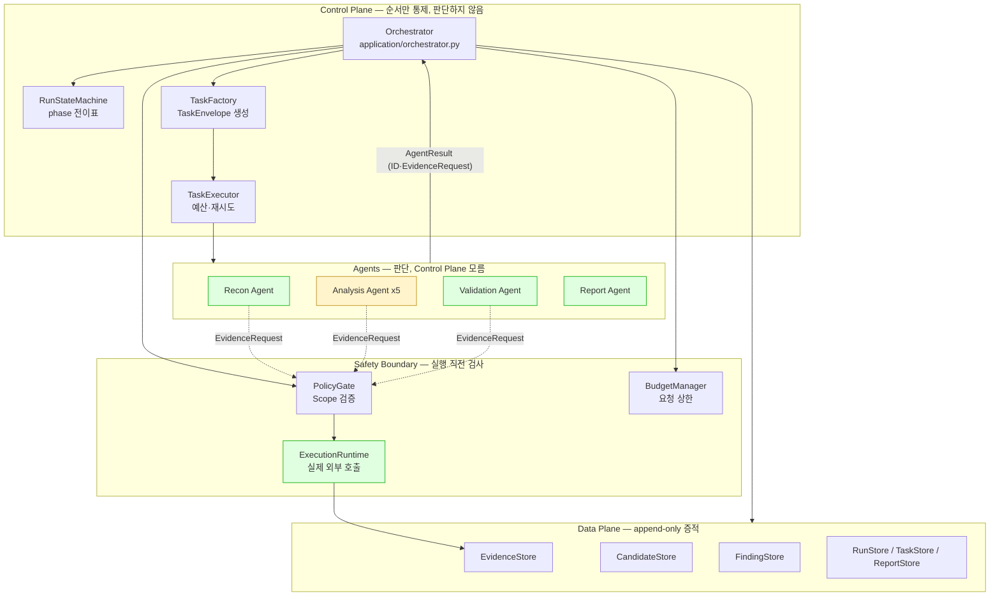
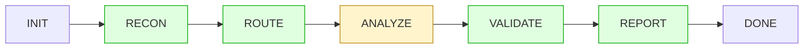
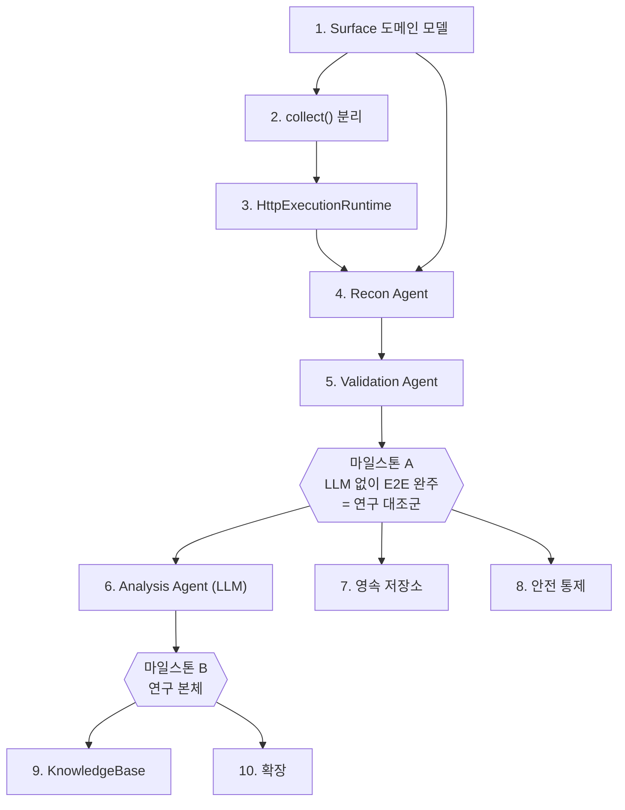

# 구현 계획 — Agentic AI 기반 모의해킹 프레임워크

이 문서는 `src/hacklipse` 스켈레톤에서 **무엇을 / 어떤 순서로 / 왜 만들어야 하는지**를 정리한다.
아키텍처 자체의 설계 근거는 Notion 연구과제 문서가 원본이고, 이 문서는 그 설계를 코드로 옮기는 작업 순서만 다룬다.

---

## 1. 현재 상태

현재는 로컬 DVWA에서 **휴리스틱과 Gemini LLM 기반 XSS·SQLi가 모두 Finding까지
도달하는 E2E**와 Phase 7 영속 저장소, Phase 8 안전 통제 baseline이 동작한다.
Control Plane은 모든 외부 실행을 중앙 수집 경계로 중재하고, Data Plane은 Validation
provenance와 취약점별 proof 불변식을 강제한다. 남은 핵심은 Phase 6의 Access Control·
Path Traversal·SSTI Agent와 baseline 대비 정식 비교 실험이다.

| 계층 | 상태 |
|---|---|
| `domain/` | ✅ `Surface`, 요청 명세, Validation proof와 실행 Scope 모델 구현 |
| `ports/` | ✅ 완성 — 계약 12종 정의됨 |
| `application/` | ✅ Orchestrator, StateMachine, TaskExecutor, TaskFactory, RuntimeEvidenceCollector |
| `adapters/` | ✅ HTTP·브라우저 Runtime, 메모리·SQLite 저장소, 인증·감사 Adapter 구현 |
| Agent 구현 | ⚠️ Recon·XSS·SQLi·Validation 구현, Access Control·Path Traversal·SSTI 미구현 |
| 안전 통제 | ✅ Phase 8 baseline 구현 완료 |

### 지금 존재하는 Agent

```
report              → adapters/reporting.py          ✅
evidence_collector  → application/execution.py       ✅
session_authenticator → adapters/authentication.py   ✅
recon               → adapters/recon.py              ✅
xss_analyzer        → heuristic / Gemini LLM 구현    ✅
sqli_analyzer       → heuristic / Gemini LLM 구현    ✅
validation          → XSS·SQLi proof 구현            ✅
access_control_analyzer → 미구현                      ❌
path_traversal_analyzer → 미구현                      ❌
ssti_analyzer       → 미구현                          ❌
```

`bootstrap.build_local_application()`은 공통 Worker를 조립하고,
`register_standard_agents()`가 Recon·XSS·SQLi·Validation 구현을 등록한다. Router는 실제로
등록된 Analyzer 유형만 Candidate로 만든다.

---

## 2. 아키텍처 지도



초록색은 구현 완료, 노란색 Analysis는 XSS·SQLi만 완료된 부분 구현 상태다.

### 현재 워크플로 상태



전체 단계는 휴리스틱 XSS·SQLi와 Gemini LLM XSS·SQLi 구성에서 실제로 완주한다.
`ANALYZE`만 5개 목표 유형 중 Access Control·Path Traversal·SSTI가 남아 있어 노란색이다.

---

## 3. 구현 순서

의존 관계상 아래 순서가 강제된다. 앞 단계를 건너뛰면 뒤에서 반드시 되돌아온다.



---

### Phase 1 — Surface 도메인 모델

**상태: ✅ 구현 완료.**

**무엇** `domain/models.py`에 `Surface` dataclass 추가, `ports/repositories.py`에 `SurfaceStore` Protocol 추가, `adapters/memory.py`에 `InMemorySurfaceStore` 추가.

```python
@dataclass(frozen=True, slots=True)
class Surface:
    surface_id: str
    run_id: str
    url: str
    method: str
    parameters: tuple[str, ...] = ()
    requires_auth: bool = False
```

**왜 먼저 필요했나** 착수 당시 `Run.surface_ids`, `Evidence.surface_id`,
`Candidate.surface_id`, `TaskEnvelope.surface_id`가 구조화된 대상 없이 문자열 ID만 공유했다.
`SurfaceStore`를 먼저 도입해 Recon이 발견한 URL·파라미터·메서드를 Analysis까지 일관되게
전달하도록 했다.

**연결되는 기능** Notion §6 "Recon이 공격 표면을 구조화한다"(URL·HTTP 메서드·파라미터·입력 폼·인증 구간). Analysis Agent가 "이 파라미터를 테스트하라"는 판단을 내리려면 파라미터 목록이 구조화되어 있어야 한다.

**아키텍처상 위치** Data Plane. Evidence(관찰된 사실)와 Candidate(가설) 사이에 있는 **대상의 구조**를 표현한다.

**완료 기준** `Run.surface_ids`에 담긴 ID로 `SurfaceStore.get()`이 실제 구조체를 반환한다. `tests/test_invariants.py`에 Surface가 run 범위를 넘지 않는지 확인하는 케이스 1개.

---

### Phase 2 — `RuntimeEvidenceCollector.collect()` 분리

**상태: ✅ 구현 완료.**

**무엇** `application/execution.py`의 `handle()` 내부를 두 개로 나눈다.

```python
def collect(self, run_id, target_url, spec, *, task_id) -> str:
    """정책→예산→Runtime→Evidence 저장 후 evidence_id 반환."""
    # 기존 handle()의 실행 경계를 공용 메서드로 분리

def handle(self, task):
    # 43-47행 계약 검사만 남기고 collect() 호출
```

**왜 필요했나** 착수 당시 Recon에는 정책 통제를 거친 HTTP 실행 경로가 없었다.
공용 `collect()` 경계를 분리해 Recon과 Evidence Worker가 같은 정책·예산·Runtime·저장
경로를 재사용하도록 했다.

우회로는 두 가지인데 하나는 틀렸다:
- ❌ Recon에 `ExecutionRuntime`을 직접 주입 → 정책·예산 검사를 건너뛴다. **Notion §18 위반.**
- ✅ Recon에 `RuntimeEvidenceCollector`를 주입하고 `collect()`를 호출 → 검사 체인 재사용.

새 추상화를 만드는 게 아니라 기존 메서드에서 10줄을 빼내는 작업이다.

**연결되는 기능** Notion §18 "모든 외부 실행은 단일 통제 경계를 거친다". 이 경계가 뚫리면 Scope 위반과 예산 초과를 코드로 막을 수 없다.

**아키텍처상 위치** Safety Boundary. `ExecutionRuntime`을 호출하는 **유일한 지점**이라는 성질을 유지하면서 호출자를 하나 늘린다.

**완료 기준** 기존 `tests/test_end_to_end.py` 전부 통과(리팩터이므로 동작 변화 없음).

---

### Phase 3 — `HttpExecutionRuntime`

**상태: ✅ 구현 완료.**

**무엇** `adapters/http_runtime.py` 신규. `urllib.request` 기반, 표준 라이브러리만 사용.

핵심 요구사항 하나: **리다이렉트를 따라가면 안 된다.**

```python
class _NoRedirect(urllib.request.HTTPRedirectHandler):
    def redirect_request(self, *args, **kwargs):
        return None
```

**왜 이 처리가 필요한가** PolicyGate는 **원래 URL만** 검증한다(`adapters/policy.py`). `urlopen`은 기본적으로 302를 따라가므로, 대상이 외부 도메인으로 리다이렉트하면 allowlist 밖으로 요청이 나간다. 리다이렉트를 `HTTPError`로 만들어 Evidence에 기록하면, 우회도 막고 리다이렉트 사실 자체도 증적으로 남는다.

**연결되는 기능** Notion §15 안전 통제. `DisabledExecutionRuntime`을 이걸로 교체하는 순간 시스템이 **처음으로 실제 네트워크를 친다.**

**아키텍처상 위치** Safety Boundary의 바깥 끝. 이 클래스 뒤가 통제 불가능한 외부 세계다.

**⚠️ 착수 전 확인** 첫 대상은 **로컬 컨테이너(DVWA / juice-shop)로 한정**하고 `RunScope.allowed_hosts`를 `localhost`로 고정한다. 실서비스를 겨냥하려면 그 대상에 대한 별도 인가 확인이 먼저다.

**완료 기준** 로컬 컨테이너 대상으로 `collect()` 1회 호출 → EvidenceStore에 응답이 저장된다. allowlist 밖으로 리다이렉트하는 엔드포인트가 `ExternalExecutionDisabled` 대신 리다이렉트 Evidence를 남기는지 확인.

---

### Phase 4 — Recon Agent (LLM 없음)

**상태: ✅ 구현 완료.**

**무엇** `adapters/recon.py`가 `RuntimeEvidenceCollector`를 통해 대상 URL을 요청하고,
BeautifulSoup/lxml 기반 HTML 폼·링크 파싱, 제한된 다단계 크롤링, JS 번들 정적 경로 분석으로
Surface를 저장한 뒤 `AgentResult(surface_ids=..., new_evidence_ids=...)`를 반환한다.

**왜 필요했나** 파이프라인의 첫 단추다. Recon이 Evidence와 Surface를 만들지 않으면
Router가 Candidate를 만들 수 없고 워크플로가 ROUTE에서 REPORT로 바로 넘어간다.

**왜 LLM을 안 쓰는가** 크롤링과 폼 추출은 결정적 작업이다. LLM을 넣으면 비용과 비결정성만 늘고 정확도는 나아지지 않는다. 그리고 이 결정적 버전이 **연구의 대조군**이 된다(Notion §17: 휴리스틱·단일 LLM·멀티에이전트 비교 실험).

**연결되는 기능** Notion §6 Recon 단계. 산출물인 `Surface`와 `Evidence`가 §8 Router의 입력이 된다.

**아키텍처상 위치** Agent 계층의 진입점. Control Plane을 전혀 모르고, `TaskEnvelope`를 받아 `AgentResult`를 돌려주기만 한다.

**완료 기준** 로컬 대상에 대해 `orchestrator.start()`가 RECON→ROUTE를 통과하고 `run.candidate_ids`가 비어 있지 않다.

---

### Phase 5 — Validation Agent (LLM 없음)

**상태: ✅ XSS·SQLi 취약점별 proof와 Finding 승격 구현 완료.**

**무엇** `adapters/validation.py` 신규. Candidate와 Evidence ID를 받아 독립 재현용
`EvidenceRequest`를 반환하고, 중앙 Collector가 수집한 현재 Validation 세션 Evidence만으로
판정을 내린다.

- 재현 성공 → `CONFIRMED`
- 증적 부족 → `evidence_requests`를 채워 반환 (Orchestrator가 수집 Task를 만든다)
- 재현 실패 → `REJECTED`

**왜 이 순서인가** Validation이 있어야 `Finding`이 생성되고, 그래야 REPORT 단계가 실제 내용을 갖는다. 그리고 `Finding.from_confirmed()`의 4개 불변식(`models.py:269-276`)이 실제 데이터로 검증된다.

**중요한 제약** Validation Task에는 **Analysis의 추론이 전달되지 않는다**(`task_factory.py:42-59`가 surface_id/candidate_id/evidence_ids만 전달). 이건 버그가 아니라 설계다 — Notion §10 "Validation은 Analysis 결론에 오염되지 않고 독립 판정한다". Validator는 증적만 보고 스스로 결론을 낸다.

**연결되는 기능** Notion §10(독립 검증), §11(증적 부족 루프). §11 루프는 `orchestrator.py:200-231`에 이미 구현되어 있고, **이 Agent가 그 루프를 처음으로 실제 작동시킨다.**

**아키텍처상 위치** Agent 계층. Data Plane에 대한 read 권한과 수집 요청 권한만 갖고, Finding 생성 권한은 없다(Orchestrator가 한다).

**완료 기준 — 🎯 마일스톤 A**
로컬 대상에 대해 `INIT → RECON → ROUTE → ANALYZE → VALIDATE → REPORT → DONE` **전 구간이 LLM 없이 완주**하고 Markdown 보고서가 나온다.
이 시점의 결과가 **연구 비교 실험의 baseline**이다.

> Phase 5까지는 Analysis Agent 자리에 "Router가 만든 Candidate를 그대로 통과시키는" 최소 구현을 넣어도 된다. Analysis의 지능은 Phase 6에서 붙인다.

---

### Phase 6 — Analysis Agent (LLM)

**상태: ⚠️ XSS·SQLi 구현 및 DVWA E2E 완료, 나머지 3종과 비교 실험 미완료.**

현재 구현은 `adapters/llm_xss_analysis.py`, `adapters/llm_sqli_analysis.py`에 있으며
`register_standard_agents()`가 같은 등록 키(`xss_analyzer`, `sqli_analyzer`) 아래에서
휴리스틱과 LLM 구현을 교체한다. 공급자 중립 계약은 `ports/llm.py`, Anthropic Adapter는
`adapters/llm_client.py`, Gemini Adapter는 `adapters/gemini_llm_client.py`에 있다.
주 실험 기본 모델은 `gemini-3.5-flash-lite`이고 Anthropic 구현도 제거하지 않고 유지한다.

Agent는 Surface와 Evidence를 읽고 LLM의 구조화 출력을 받아 탐침 대상을 선택하지만,
외부 요청을 직접 수행하지 않는다. `EvidenceRequest`를 반환하면 Orchestrator가 중앙
`RuntimeEvidenceCollector`를 통해 Scope·도구 권한·예산·감사·마스킹을 적용한 뒤 수집한다.
LLM은 파라미터 이름이나 응답 맥락만 제안하며, 실제 marker·probe 값과 반사/SQL 오류
사실 판정은 Python이 담당한다. 최종 확정은 Analysis Evidence를 그대로 신뢰하지 않고
Validation이 별도 control/probe를 재현해 `XSS_EXECUTION` 또는 `SQLI_EFFECT` proof를
만들었을 때만 가능하다.

| Agent | 휴리스틱 | LLM | 실제 E2E |
|---|---:|---:|---:|
| XSS | ✅ | ✅ Gemini | ✅ DVWA → `XSS_EXECUTION` → Finding |
| SQLi | ✅ | ✅ Gemini | ✅ DVWA → `SQLI_EFFECT` → Finding |
| Access Control | ❌ | ❌ | ❌ |
| Path Traversal | ❌ | ❌ | ❌ |
| SSTI | ❌ | ❌ | ❌ |

**왜 마지막인가** **연구의 본체이자 가장 비싼 부분이다.** Phase 1~5가 없으면 LLM에게 줄 입력(구조화된 Surface, 실제 응답 Evidence)이 없어서 프롬프트를 설계할 수 없다. 그리고 대조군이 먼저 있어야 "LLM이 실제로 나은가"를 측정할 수 있다.

**연결되는 기능** Notion §9 Analysis 단계, §17 비교 실험. LLM 호출 비용이 §3 예산 관리의 실제 대상이 된다(현재 `InMemoryBudgetManager`는 요청 횟수만 세므로 Phase 10에서 교체 필요).

**아키텍처상 위치** Agent 계층. 5개 Agent는 서로를 전혀 모르고, 공유 상태도 없다. 통신은 Orchestrator를 통한 Task/Result뿐이다(Notion §18).

**완료 기준 — 🎯 마일스톤 B** 결정적 baseline과 LLM 버전의 탐지율·오탐률을 같은
대상에서 비교할 수 있다. 현재 XSS·SQLi 양쪽 실행 경로는 완주했지만, 고정 데이터셋과
반복 실행을 이용한 정식 탐지율·오탐률 측정은 아직 남아 있으므로 마일스톤 B 전체는
완료로 표시하지 않는다.

---

### Phase 7 — 영속 저장소

**상태: ✅ 구현 완료.** `adapters/sqlite_store.py`가 Run·Task·Evidence·Surface·Candidate·
Finding·Report 저장소를 제공하고, `adapters/sqlite_budget.py`가 재개 가능한 요청 예산을
제공한다. `tests/test_persistence_resume.py`와 `tests/test_sqlite_store.py`가 프로세스 재시작
후 저장·재개 동작을 검증한다.

**왜** 메모리 구현만 사용하면 프로세스가 끝날 때 Run이 사라진다. SQLite Adapter는
`Orchestrator.resume(run_id)`가 재시작 이후에도 중단 지점부터 이어질 수 있게 한다.

**연결되는 기능** Notion §4 "실행 상태 저장과 재개". 장시간 Run, 중단 후 재개, 실험 결과 보존이 전부 여기 달려 있다.

**아키텍처상 위치** Data Plane 어댑터 교체. `EvidenceStore` Protocol에 `update`가 없다는 점(append-only)을 스키마에서도 유지한다 — Evidence 테이블에 UPDATE를 하지 않는다.

**완료 기준** 프로세스를 죽였다 살린 뒤 `resume(run_id)`가 중단 지점부터 이어서 실행된다.

---

### Phase 8 — 안전 통제

**상태: ✅ 계획된 baseline 구현 완료.** 실제 대상 실행 전에 필요한 통제를 중앙 실행
경계에 연결했다. XSS E2E를 위해 계획상 Phase 10이던 Browser Runtime의 제한된 구현도
이 단계에서 선행했다.

| 항목 | 구현 상태 | 코드 |
|---|---|---|
| 실행시간 제한 | ✅ Task·HTTP·LLM·브라우저 실행에 적용 | `application/task_executor.py`, 각 Runtime |
| 인증정보 참조 | ✅ `credential_ref` Resolver와 form login, Run별 Cookie 세션 | `ports/security.py`, `adapters/authentication.py`, `adapters/http_runtime.py` |
| 민감정보 마스킹 | ✅ Evidence 저장 직전에 Cookie·토큰·PII 제거 | `adapters/security.py`, `application/execution.py` |
| 전체 실행 감사 로그 | ✅ 메모리·SQLite append-only 감사 로그 | `adapters/security.py` |
| 위험 요청 사람 승인 | ✅ 기본 거부 및 명시적 승인 참조 검사 | `adapters/policy.py`, `ports/errors.py` |
| Agent별 도구 allowlist | ✅ 등록 권한과 Task 요청 권한을 Dispatcher에서 교차 검사 | `adapters/dispatcher.py` |
| 인증 성공 확인 | ✅ 로그인 POST 후 보호 페이지를 별도로 요청해 검증 | `adapters/authentication.py` |
| XSS Browser Runtime | ✅ 고정 probe, Run Cookie 전달, 동일 origin·Scope 제한 | `adapters/browser_runtime.py`, `adapters/xss_execution.py` |

**왜 이 시점인가** Phase 3에서 실제 네트워크가 열렸고, Phase 6에서 LLM이 요청을 생성하기 시작한다. **LLM이 만든 요청이 통제 없이 나가는 구간이 생기면 안 된다.** 마스킹과 감사 로그는 특히 Phase 6 전에 있는 게 안전하다.

**아키텍처상 위치** Safety Boundary 강화. Agent는 실행하지 않고 요청만 반환하며,
Policy·예산·마스킹·감사·Runtime 선택은 중앙 `RuntimeEvidenceCollector`가 담당한다.

**필수 완료 기준 밖의 후속 보강 후보**

- `ApprovalRequired` 발생 시 Run을 실패시키지 않고 승인 대기 상태로 저장한 뒤 재개
- InMemory가 아닌 운영용 Credential Resolver 연결
- 장시간 Run의 세션 만료 감지·재인증 및 명시적 세션 정리

---

### Phase 9 — KnowledgeBase

**무엇** `ports/knowledge.py`의 `KnowledgeBase` Protocol 구현.

**왜 마지막인가** 이 Port는 정의만 되어 있고 **`ports/` 밖 어디에서도 참조되지 않는다.** Orchestrator에 주입 지점조차 없어서 배선부터 새로 해야 한다. 그리고 축적할 지식(과거 Run의 Finding)이 있어야 의미가 있으므로 Phase 6 이후가 자연스럽다.

**연결되는 기능** 과거 사례 재사용, RAG. `KnowledgeCase.provenance_refs`가 출처 추적용으로 이미 준비되어 있다.

**아키텍처상 위치** **Evidence Store와 의도적으로 분리된 별도 Plane.**
Evidence는 "이번 대상에서 직접 관찰한 사실", Knowledge는 "민감정보를 제거하고 일반화한 재사용 지식"이다. 이 둘을 섞으면 다른 대상의 데이터가 현재 Run의 증적으로 오염된다.

---

### Phase 10 — 확장

우선순위 낮음. 필요해지면 교체한다.

| 항목 | 현재 | 교체 방향 |
|---|---|---|
| `InMemoryBudgetManager` | 요청 횟수만 카운트 | LLM 토큰·비용·시간 기반 (Notion §3) |
| `RuleBasedVulnerabilityRouter` | 고정 규칙 5개 | 모호한 사례만 LLM 라우팅 (Notion §8) |
| `BoundedRetryPolicy(max_attempts=1)` | 사실상 재시도 없음 | 백오프 + 실패 유형별 정책 |
| `MarkdownReportAgent` | Markdown만 | JSON / HTML / PDF / Dashboard (Notion §13) |
| `Finding.severity` | 항상 `"unrated"` | CVSS 등 산정 로직 |
| `RouteDecision.priority` | 정렬에만 사용 | 예산 배분에 반영 |
| `AllowlistPolicyGate` | `safe` 프로필 하나 | 프로필별 정책 분리 |
| 실행 Runtime | HTTP + XSS proof 전용 브라우저 | DOM Recon·범용 JS 실행이 필요한 범위로 제한 확장 |

---

## 4. 파일 매니페스트

🆕 신규 생성 · ✏️ 기존 수정

### Phase 1 — Surface 도메인 모델 (신규 파일 없음)

| | 파일 | 작업 |
|---|---|---|
| ✏️ | `src/hacklipse/domain/models.py` | `Surface` dataclass 추가 |
| ✏️ | `src/hacklipse/domain/__init__.py` | `Surface` export |
| ✏️ | `src/hacklipse/ports/repositories.py` | `SurfaceStore` Protocol 추가 |
| ✏️ | `src/hacklipse/ports/__init__.py` | `SurfaceStore` export |
| ✏️ | `src/hacklipse/adapters/memory.py` | `InMemorySurfaceStore` + `MemoryStoreBundle.surfaces` |
| ✏️ | `tests/test_invariants.py` | Surface가 run 범위를 넘지 않는지 1케이스 |

### Phase 2 — collect() 분리 (파일 1개)

| | 파일 | 작업 |
|---|---|---|
| ✏️ | `src/hacklipse/application/execution.py` | `handle()` 49–81행 → `collect()`로 이동 |

테스트는 손대지 않는다. 기존 `tests/test_end_to_end.py`가 그대로 통과해야 리팩터가 맞은 것이다.

### Phase 3 — HttpExecutionRuntime

| | 파일 | 작업 |
|---|---|---|
| 🆕 | `src/hacklipse/adapters/http_runtime.py` | `HttpExecutionRuntime`, `_NoRedirect` |
| ✏️ | `src/hacklipse/adapters/__init__.py` | export 추가 |
| 🆕 | `tests/test_http_runtime.py` | 리다이렉트가 allowlist를 넘지 않는지 |

`adapters/runtime.py`의 `DisabledExecutionRuntime`은 **지우지 않는다.** 기본값으로 계속 쓰인다.

### Phase 4 — Recon Agent

| | 파일 | 작업 |
|---|---|---|
| 🆕 | `src/hacklipse/adapters/recon.py` | `ReconAgent` — `html.parser`로 폼·링크·파라미터 추출 |
| ✏️ | `src/hacklipse/adapters/__init__.py` | export 추가 |
| ✏️ | `src/hacklipse/application/task_factory.py` | `recon()`에 `allowed_tools=("http_get",)` 부여 |
| ✏️ | `src/hacklipse/bootstrap.py` | `LocalApplication`에 `collector` 필드 노출 |
| 🆕 | `tests/test_recon.py` | Surface 추출 결과 |

> **`bootstrap.py`를 왜 건드려야 하나** — `RuntimeEvidenceCollector`는 `build_local_application()` **안에서** 생성되는데(`bootstrap.py:77`), `ReconAgent`는 그 collector를 주입받아야 하면서 동시에 `agents` 인자로 **들어가야** 한다. 순환이다.
> 가장 짧은 해법: `LocalApplication`에 `collector` 필드를 추가하고, 빌드 후 `app.dispatcher.register("recon", ReconAgent(collector=app.collector, ...))`로 등록한다. 필드 1개 + 반환값 1줄.

### Phase 5 — Validation Agent

| | 파일 | 작업 |
|---|---|---|
| 🆕 | `src/hacklipse/adapters/validation.py` | `ValidationAgent` — 재현 후 verdict 판정 |
| ✏️ | `src/hacklipse/adapters/__init__.py` | export 추가 |
| 🆕 | `tests/test_validation.py` | CONFIRMED / REJECTED / 증적부족 3케이스 |

### Phase 6 — Analysis Agent ×5

| 상태 | 파일 | 구현 결과 / 작업 |
|---|---|---|
| ✅ | `src/hacklipse/ports/llm.py` | 공급자 중립 `LlmClient`와 구조화 요청·응답·사용량 계약 |
| ✅ | `src/hacklipse/adapters/llm_client.py` | `urllib` 기반 Anthropic Adapter 유지 |
| ✅ | `src/hacklipse/adapters/gemini_llm_client.py` | Gemini Interactions API, 구조화 JSON, 오류·사용량 변환 |
| ✅ | `src/hacklipse/adapters/llm_xss_analysis.py` | LLM 파라미터 선택·반사 맥락 분류, Python 반사 사실 확인 |
| ✅ | `src/hacklipse/adapters/llm_sqli_analysis.py` | LLM 파라미터 선택, Python control/probe SQL 오류 차이 판정 |
| ✅ | `src/hacklipse/adapters/probing.py` | XSS·SQLi 공용 probe와 LLM 선택값 검증 |
| ❌ | `src/hacklipse/adapters/llm_access_control_analysis.py` | 미구현 |
| ❌ | `src/hacklipse/adapters/llm_path_traversal_analysis.py` | 미구현 |
| ❌ | `src/hacklipse/adapters/llm_ssti_analysis.py` | 미구현 |
| ✅ | `tests/test_llm_xss_analysis.py` | FakeLLM 계약·프롬프트 위생·중앙 중재 검증 |
| ✅ | `tests/test_llm_sqli_analysis.py` | FakeLLM 선택·안전 probe·SQL 오류 신호 검증 |
| ✅ | `tests/test_llm_end_to_end.py` | FakeLLM 전체 배선 및 SQLi proof/Finding 완주 검증 |
| ✅ | `scripts/run_dvwa_baseline.py` | Gemini XSS·SQLi 실제 E2E와 안전한 디버그 출력 |

파일명이 아니라 **등록 키**가 `adapters/routing.py`의 `DEFAULT_RULES`와 일치해야 한다 — `xss_analyzer`, `sqli_analyzer`, `access_control_analyzer`, `path_traversal_analyzer`, `ssti_analyzer`.

XSS와 SQLi를 구현하며 실제로 반복된 control/probe 생성·Evidence 매칭·LLM 선택값 검증만
`adapters/probing.py`로 추출했다. 공급자 Adapter는 SDK 없이 표준 라이브러리 `urllib`을
사용하며, Agent는 Gemini·Anthropic 고유 형식을 알지 못한다.

### Phase 7 — 영속 저장소

| 상태 | 파일 | 구현 결과 |
|---|---|---|
| ✅ | `src/hacklipse/adapters/sqlite_store.py` | 7개 Store + `SQLiteStoreBundle` |
| ✅ | `src/hacklipse/adapters/sqlite_budget.py` | 원자적 예약·환불과 재개 가능한 요청 예산 |
| ✅ | `src/hacklipse/adapters/__init__.py` | SQLite Adapter export |
| ✅ | `src/hacklipse/bootstrap.py` | `StoreBundle`과 `BudgetManager` 교체 주입 |
| ✅ | `tests/test_sqlite_store.py` | Store·예산 영속성 검증 |
| ✅ | `tests/test_persistence_resume.py` | 재시작 후 `resume()` 검증 |

Evidence 테이블에는 **UPDATE 문을 쓰지 않는다.** `EvidenceStore` Protocol에 `update`가 없는 성질을 스키마에서도 유지한다.

### Phase 8 — 안전 통제

| | 파일 | 구현 결과 |
|---|---|---|
| ✅ | `src/hacklipse/application/task_executor.py` | `timeout_seconds` 실제 적용 |
| ✅ | `src/hacklipse/ports/security.py` | Credential·승인·마스킹·감사 Protocol |
| ✅ | `src/hacklipse/adapters/security.py` | Resolver·Sanitizer·ApprovalGate·AuditLog 구현 |
| ✅ | `src/hacklipse/adapters/authentication.py` | CSRF form login과 보호 자원 검증 |
| ✅ | `src/hacklipse/application/execution.py` | 저장 직전 마스킹과 전 실행 감사 훅 |
| ✅ | `src/hacklipse/adapters/policy.py` | Scope·상태 변경 요청·브라우저 probe 정책 |
| ✅ | `src/hacklipse/ports/errors.py` | `ApprovalRequired`, 인증·실행 오류 |
| ✅ | `src/hacklipse/adapters/browser_runtime.py` | 인증 세션을 사용하는 XSS 실행 검증 |
| ✅ | `tests/test_phase8_security.py` | 인증·마스킹·timeout·승인·감사 테스트 |
| ✅ | `tests/test_browser_runtime.py` | 고정 XSS probe·Cookie·동일 origin 테스트 |

### Phase 9 — KnowledgeBase

| | 파일 | 작업 |
|---|---|---|
| 🆕 | `src/hacklipse/adapters/knowledge.py` | `KnowledgeBase` 구현 |
| ✏️ | `src/hacklipse/application/orchestrator.py` | 주입 지점 신설 (**현재 없음**) |
| ✏️ | `src/hacklipse/bootstrap.py` | 배선 |

### Phase 10 — 확장

| | 파일 |
|---|---|
| 🆕 | `src/hacklipse/adapters/cost_budget.py` — 토큰·비용 기반 예산 |
| 🆕 | `src/hacklipse/adapters/llm_routing.py` — 모호 사례 LLM 라우팅 |
| 🆕 | `src/hacklipse/adapters/reporting_json.py` — JSON/HTML 보고서 |
| 🆕 | `src/hacklipse/adapters/severity.py` — `Finding.severity` 산정 |
| ✅ | `src/hacklipse/adapters/browser_runtime.py` — XSS proof 범위에서 Phase 8에 선행 구현 |

### 최종 트리

```
src/hacklipse/
├── domain/
│   ├── models.py                    ✏️ P1  Surface
│   └── errors.py
├── ports/
│   ├── repositories.py              ✏️ P1  SurfaceStore
│   ├── llm.py                       🆕 P6
│   ├── security.py                  ✅ P8  Credential·승인·감사 계약
│   ├── errors.py                    ✅ P8  ApprovalRequired 등
│   ├── agents.py · control.py · runtime.py · knowledge.py
├── application/
│   ├── execution.py                 ✏️ P2 collect() · ✏️ P8 훅
│   ├── task_factory.py              ✏️ P4  allowed_tools
│   ├── task_executor.py             ✏️ P8  timeout
│   ├── orchestrator.py              ✏️ P9  KnowledgeBase 주입
│   └── state_machine.py · errors.py
├── adapters/
│   ├── memory.py                    ✏️ P1  InMemorySurfaceStore
│   ├── http_runtime.py              🆕 P3
│   ├── recon.py                     🆕 P4
│   ├── validation.py                🆕 P5
│   ├── llm_client.py                ✅ P6  Anthropic Adapter
│   ├── gemini_llm_client.py         ✅ P6  Gemini Adapter
│   ├── llm_xss_analysis.py          ✅ P6  XSS LLM Agent
│   ├── llm_sqli_analysis.py         ✅ P6  SQLi LLM Agent
│   ├── probing.py                   ✅ P6  공용 control/probe 계약
│   ├── sqlite_store.py              ✅ P7  7개 영속 Store
│   ├── sqlite_budget.py             ✅ P7  영속 요청 예산
│   ├── security.py                  ✅ P8  Resolver·마스킹·감사·승인
│   ├── authentication.py            ✅ P8  form login·보호 자원 검증
│   ├── request_safety.py            ✅ P8  상태 변경성 GET 차단
│   ├── policy.py                    ✅ P8  Scope·사람 승인
│   ├── browser_runtime.py           ✅ P8  XSS 실행 증명
│   ├── xss_execution.py             ✅ P8  고정 browser probe 계약
│   ├── knowledge.py                 🆕 P9
│   ├── cost_budget.py               🆕 P10
│   ├── llm_routing.py               🆕 P10
│   ├── reporting_json.py            🆕 P10
│   ├── severity.py                  🆕 P10
│   ├── __init__.py                  ✏️ P3·4·5·7  export
│   └── budget.py · dispatcher.py · reporting.py · retry.py · routing.py · runtime.py
└── bootstrap.py                     ✏️ P4 collector · ✏️ P7 store · ✏️ P9 knowledge

tests/
├── test_invariants.py               ✏️ P1
├── test_http_runtime.py             🆕 P3
├── test_recon.py                    🆕 P4
├── test_validation.py               🆕 P5
├── test_llm_xss_analysis.py         ✅ P6
├── test_llm_sqli_analysis.py        ✅ P6
├── test_llm_end_to_end.py           ✅ P6
├── test_gemini_llm_client.py        ✅ P6
├── test_sqlite_store.py             ✅ P7
├── test_persistence_resume.py       ✅ P7
├── test_phase8_security.py          ✅ P8
├── test_browser_runtime.py          ✅ P8
└── test_end_to_end.py · test_dependency_direction.py   (변경 없음)
```

위 트리는 최초 계획에서 시작했으며, 실제 구현에서는 관련 P8 Adapter를
`security.py`에 묶고 인증·브라우저 경계를 별도 파일로 분리했다.

---

## 5. 체크리스트

```
Phase 1  [x] Surface dataclass
         [x] SurfaceStore Protocol
         [x] InMemorySurfaceStore + MemoryStoreBundle 연결

Phase 2  [x] RuntimeEvidenceCollector.collect() 분리
         [x] 기존 테스트 전부 통과

Phase 3  [x] HttpExecutionRuntime + _NoRedirect
         [x] 로컬 대상 실행 검증

Phase 4  [x] ReconAgent (HTML 파싱 → Surface)
         [x] run.candidate_ids 비어 있지 않음

Phase 5  [x] ValidationAgent (독립 재현 → 판정)
         [x] evidence_requests 루프 실동작 확인
         [x] XSS_EXECUTION·SQLI_EFFECT proof와 Finding 승격
         [x] 🎯 마일스톤 A — LLM 없이 E2E 완주

Phase 6  [x] XSS 휴리스틱 / Gemini LLM Agent와 DVWA E2E
         [x] SQLi 휴리스틱 / Gemini LLM Agent와 DVWA E2E
         [ ] Access Control Agent
         [ ] Path Traversal Agent
         [ ] SSTI Agent
         [ ] 🎯 마일스톤 B — baseline 대비 측정

Phase 7  [x] SQLite 저장소 7종과 SQLiteBudgetManager
         [x] 프로세스 재시작 후 resume 확인

Phase 8  [x] timeout_seconds 실제 적용
         [x] credential_ref resolver와 인증 세션
         [x] 민감정보 마스킹
         [x] 감사 로그
         [x] 사람 승인 게이트
         [x] Agent별 도구 allowlist
         [x] XSS Browser Runtime 선행 구현

Phase 9  [ ] KnowledgeBase 구현 + Orchestrator 배선

Phase 10 [ ] 비용 예산 / LLM Router / 보고서 포맷 / severity
         [x] XSS proof 범위의 브라우저 Runtime은 Phase 8에서 선행 구현
```

---

## 6. 작업 중 지켜야 할 것

Notion §18의 규칙은 전부 **컴포넌트 간 관계에 대한 금지**다. 프롬프트로 강제할 수 없고 타입과 계층으로만 막을 수 있다.

- Agent는 다른 Agent를 직접 호출하지 않는다. 통신은 `TaskEnvelope`/`AgentResult`뿐.
- Agent는 `ExecutionRuntime`을 직접 호출하지 않는다. 반드시 `RuntimeEvidenceCollector`를 통과한다.
- Evidence는 append-only다. `EvidenceStore` Protocol에 `update`가 없는 것은 의도다.
- Validation은 Analysis의 결론을 보지 않는다.
- Finding은 `Finding.from_confirmed()`로만 만든다.
- `adapters/`는 `application/`을 import하지 않는다 — `tests/test_dependency_direction.py`가 AST로 검사한다.

새 구현을 추가할 때마다 다음을 돌린다.

```bash
PYTHONPATH=src python3 -m unittest discover -s tests -v
```

### 대상 범위

Phase 3부터 실제 요청이 나간다.
초기 대상은 **로컬 컨테이너(DVWA / juice-shop)로 한정**하고 `RunScope.allowed_hosts`를 `localhost`로 고정한다.
실서비스나 외부 대상으로 옮기려면 그 대상에 대한 별도 인가 확인이 선행되어야 한다.
